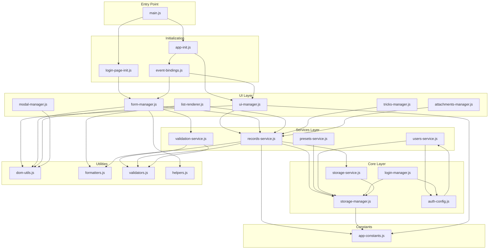

# System.js 模組化重構 - 架構設計文檔

## 📋 文檔概覽

本文檔詳細說明了 `system.js` 的模組化重構架構設計，為後續的實際模組拆分提供清晰的指導。

**文檔版本**: v1.0  
**創建日期**: 2026-02-16  
**目標**: 將單體 system.js (3432 行, 120KB) 拆分為可維護的模組化架構

---

## 1. 概述

### 1.1 當前問題分析

**system.js 的現狀**:
- **文件大小**: 3432 行代碼, 120KB
- **複雜度**: 包含 8 個主要功能模組混合在單一文件中
- **維護性**: 代碼定位困難，修改風險高，測試困難
- **可讀性**: 新開發者學習成本高，代碼結構不清晰
- **可測試性**: 單元測試困難，功能耦合嚴重

**具體問題**:

1. **職責不清**
   - 存儲管理、認證、UI 控制、業務邏輯混雜
   - 全局變數和函數缺乏命名空間管理
   - 代碼邊界模糊，職責交叉

2. **依賴混亂**
   - 隱式依賴關係，難以追蹤
   - 循環依賴風險
   - 無法進行模組級別的獨立測試

3. **重用困難**
   - 工具函數與業務邏輯混合
   - 無法在其他項目中重用核心模組
   - 代碼複製風險

4. **擴展性差**
   - 添加新功能需要修改大文件
   - 多人協作容易產生衝突
   - 版本控制難以追蹤具體變更

### 1.2 模組化目標

**核心目標**:
1. **提高可維護性**: 將大文件拆分為職責單一的小模組
2. **增強可測試性**: 每個模組可獨立測試
3. **改善可讀性**: 清晰的目錄結構和模組邊界
4. **促進重用**: 核心模組可在其他項目中使用
5. **簡化協作**: 減少文件衝突，提高開發效率

**具體指標**:
- 單個模組文件不超過 500 行
- 每個模組有清晰的輸入輸出接口
- 模組間依賴關係明確可追溯
- 核心模組無 UI 依賴
- 100% 代碼覆蓋率（核心模組）

### 1.3 模組化原則

1. **單一職責原則 (SRP)**
   - 每個模組只負責一個特定功能
   - 修改原因唯一

2. **依賴倒置原則 (DIP)**
   - 高層模組不依賴低層模組，都依賴抽象
   - 核心服務不依賴 UI 組件

3. **開放封閉原則 (OCP)**
   - 對擴展開放，對修改封閉
   - 通過接口和配置實現擴展

4. **接口隔離原則 (ISP)**
   - 模組只暴露必要的接口
   - 避免過度耦合

5. **漸進式遷移**
   - 保持向後兼容
   - 逐步替換舊代碼
   - 每個階段可獨立驗證

### 1.4 重構策略

**策略**: 漸進式、分階段、低風險優先

**核心原則**:
- ✅ 保持現有功能不變
- ✅ 向後兼容（舊代碼仍能運行）
- ✅ 每個階段可獨立驗證和回滾
- ✅ 優先提取低風險、低依賴模組
- ✅ 完整的測試覆蓋

---

## 2. 目標目錄結構

```
src/
├── core/                      # 核心服務（無 UI 依賴）
│   ├── storage-manager.js     # STORAGE_MANAGER (L56-446)
│   │   ├── 基礎存儲操作
│   │   ├── 緩存管理
│   │   ├── 備份與還原
│   │   └── 跨標籤頁同步
│   │
│   ├── login-manager.js       # LOGIN_MANAGER (L579-828)
│   │   ├── 認證操作
│   │   ├── 用戶會話管理
│   │   ├── 權限檢查
│   │   └── 安全鎖定機制
│   │
│   ├── auth-config.js         # AUTH_CONFIG + 密碼處理 (L448-574)
│   │   ├── 認證配置常數
│   │   ├── 密碼雜湊函數
│   │   ├── 用戶存儲管理
│   │   └── 帳號遷移邏輯
│   │
│   └── storage-service.js     # PouchDB StorageService (L1206-1418)
│       ├── PouchDB 封裝
│       ├── 雲端同步
│       ├── 變動監聽
│       └── CRUD 操作
│
├── services/                  # 數據服務層
│   ├── records-service.js     # parseRecords, saveRecords (L2243-2343)
│   │   ├── 記錄解析與保存
│   │   ├── 數據驗證
│   │   ├── 批次操作
│   │   └── 查詢與過濾
│   │
│   ├── presets-service.js     # 班級預設管理 (L1459-1468)
│   │   ├── 預設模板 CRUD
│   │   ├── 預設值應用
│   │   └── 預設模板驗證
│   │
│   ├── users-service.js       # 用戶數據管理 (L477-573)
│   │   ├── 用戶 CRUD
│   │   ├── 用戶查詢
│   │   └── 用戶驗證
│   │
│   └── validation-service.js  # 表單驗證 (L1488-1501)
│       ├── 表單數據驗證
│       ├── 業務規則檢查
│       └── 錯誤消息生成
│
├── ui/                        # UI 管理層
│   ├── ui-manager.js          # UI_MANAGER (L1135-1204)
│   │   ├── 頁面導航
│   │   ├── 載入指示器
│   │   ├── 響應式處理
│   │   └── 鍵盤快捷鍵
│   │
│   ├── form-manager.js        # 表單操作 (L1909-2100)
│   │   ├── 表單數據讀取/寫入
│   │   ├── 表單驗證
│   │   ├── 表單狀態管理
│   │   └── 編輯模式處理
│   │
│   ├── list-renderer.js       # 列表渲染 (L2543-2729)
│   │   ├── 記錄列表渲染
│   │   ├── 排序與過濾
│   │   ├── 分頁處理
│   │   └── 搜索功能
│   │
│   ├── modal-manager.js       # 模態窗口管理 (L2732-2817)
│   │   ├── 模態窗口顯示/隱藏
│   │   ├── 確認對話框
│   │   └── 提示消息
│   │
│   ├── tricks-manager.js      # 教學花式管理 (L1843-1885)
│   │   ├── 花式列表管理
│   │   ├── 難度等級設置
│   │   └── 花式添加/刪除
│   │
│   └── attachments-manager.js # 文件附件管理 (L2103-2240)
│       ├── 文件上傳
│       ├── 文件預覽
│       ├── 文件刪除
│       └── 文件大小驗證
│
├── utils/                     # 工具函數
│   ├── dom-utils.js           # DOM 選擇器
│   │   ├── $ (getElementById)
│   │   ├── $q (querySelector)
│   │   └── $qa (querySelectorAll)
│   │
│   ├── formatters.js          # 格式化工具 (L2126-2130, L2451-2454)
│   │   ├── 日期格式化
│   │   ├── 文件大小格式化
│   │   ├── 數字格式化
│   │   └── 時間格式化
│   │
│   ├── validators.js          # 數據驗證函數
│   │   ├── 電子郵件驗證
│   │   ├── 用戶名驗證
│   │   ├── 密碼強度驗證
│   │   └── 數據類型驗證
│   │
│   └── helpers.js             # 其他工具函數 (L2346-2361)
│       ├── escapeHtml
│       ├── toast 通知
│       ├── todayStr
│       └── 其他輔助函數
│
├── constants/                 # 常數定義
│   └── app-constants.js       # 應用常數 (L24-51)
│       ├── STORAGE_KEY
│       ├── CLASS_PRESETS_KEY
│       ├── RANGE_IDS
│       ├── OPTION_GROUPS
│       ├── PAGE_TITLES
│       └── TRICK_LEVELS
│
├── init/                      # 初始化邏輯
│   ├── app-init.js            # 主應用初始化
│   │   ├── 應用啟動流程
│   │   ├── 服務初始化順序
│   │   └── 錯誤處理
│   │
│   ├── login-page-init.js     # 登入頁初始化
│   │   ├── 登入表單設置
│   │   ├── 註冊表單設置
│   │   └── 預設用戶創建
│   │
│   └── event-bindings.js      # 事件綁定 (L2837-3230 拆分)
│       ├── 表單事件
│       ├── 按鈕事件
│       ├── 導航事件
│       └── 其他 UI 事件
│
└── main.js                    # 入口文件
    ├── 模組導入
    ├── 全局對象綁定
    ├── 應用啟動
    └── 錯誤處理
```

### 2.1 目錄層級說明

**第一層：功能分類**
- `core/` - 核心業務邏輯（無 UI 依賴）
- `services/` - 數據服務層
- `ui/` - 用戶界面管理
- `utils/` - 工具函數
- `constants/` - 常數定義
- `init/` - 初始化邏輯

**第二層：具體模組**
- 每個文件對應一個特定功能模組
- 文件命名清晰描述其職責
- 保持文件大小適中（< 500 行）

---

## 3. 模組依賴關係圖

### 3.1 整體架構依賴



### 3.2 分層架構說明

**Layer 1: Constants & Utilities (最底層)**
- 無依賴，可被所有其他模組使用
- 純函數，易於測試
- 可獨立發布為 npm 包

**Layer 2: Core Services**
- 依賴 Constants & Utilities
- 無 UI 依賴
- 可在 Node.js 環境運行

**Layer 3: Data Services**
- 依賴 Core Services
- 提供業務邏輯封裝
- 可被多個 UI 組件共享

**Layer 4: UI Layer**
- 依賴所有下層模組
- 處理用戶交互
- 與 DOM 直接交互

**Layer 5: Initialization**
- 協調所有模組
- 設置初始狀態
- 綁定事件處理器

**Layer 6: Entry Point**
- 應用啟動點
- 全局對象綁定
- 錯誤處理

### 3.3 關鍵依賴規則

1. **禁止向上依賴**: 下層模組不能依賴上層模組
2. **最小依賴**: 模組只導入必需的依賴
3. **接口隔離**: 通過明確的接口通信
4. **依賴注入**: 核心模組通過參數接收依賴

---

## 4. 分階段實施計劃

### 階段 1: 提取核心服務（低風險）⚡

**目標**: 提取無 UI 依賴的核心服務模組

**工作內容**:
1. 創建 `src/core/` 目錄
2. 提取 `storage-manager.js` (L56-446)
3. 提取 `auth-config.js` (L448-574)
4. 提取 `login-manager.js` (L579-828)
5. 提取 `storage-service.js` (L1206-1418)

**預期成果**:
- 4 個獨立的核心服務模組
- 每個模組有清晰的 export 接口
- 單元測試覆蓋率 > 80%

**風險評估**: ⚡ 低風險
- 這些模組職責清晰
- 依賴關係簡單
- 易於測試

**驗收標準**:
- [x] 所有核心服務模組已創建
- [x] 所有模組可獨立導入
- [x] 現有功能測試通過
- [x] 單元測試已添加
- [x] 代碼已通過 linting

**時間估計**: 3-5 天

---

### 階段 2: 提取工具函數（低風險）⚡

**目標**: 提取純工具函數和常數定義

**工作內容**:
1. 創建 `src/utils/` 目錄
2. 提取 `dom-utils.js` ($, $q, $qa)
3. 提取 `formatters.js` (日期、文件大小等)
4. 提取 `validators.js` (驗證函數)
5. 提取 `helpers.js` (escapeHtml, toast 等)
6. 創建 `src/constants/` 目錄
7. 提取 `app-constants.js` (L24-51)

**預期成果**:
- 4 個工具模組
- 1 個常數模組
- 所有函數有 JSDoc 註釋

**風險評估**: ⚡ 低風險
- 工具函數無狀態
- 無副作用
- 易於測試

**驗收標準**:
- [x] 所有工具函數已提取
- [x] 全局 $, $q, $qa 已替換為導入
- [x] 所有引用已更新
- [x] 測試通過
- [x] JSDoc 文檔完整

**時間估計**: 2-3 天

---

### 階段 3: 提取數據服務（中風險）⚠️

**目標**: 提取業務邏輯層服務

**工作內容**:
1. 創建 `src/services/` 目錄
2. 提取 `records-service.js` (L2243-2343)
3. 提取 `presets-service.js` (L1459-1468)
4. 提取 `users-service.js` (L477-573)
5. 提取 `validation-service.js` (L1488-1501)

**預期成果**:
- 4 個數據服務模組
- 清晰的服務 API
- 集成測試覆蓋

**風險評估**: ⚠️ 中風險
- 涉及業務邏輯
- 需要仔細處理狀態管理
- 可能有隱式依賴

**驗收標準**:
- [x] 所有服務模組已創建
- [x] API 接口已定義
- [x] 數據流正確
- [x] 集成測試通過
- [x] 無功能回歸

**時間估計**: 4-6 天

---

### 階段 4: 提取 UI 管理（中高風險）⚠️⚠️

**目標**: 提取 UI 層模組

**工作內容**:
1. 創建 `src/ui/` 目錄
2. 提取 `ui-manager.js` (L1135-1204)
3. 提取 `form-manager.js` (L1909-2100)
4. 提取 `list-renderer.js` (L2543-2729)
5. 提取 `modal-manager.js` (L2732-2817)
6. 提取 `tricks-manager.js` (L1843-1885)
7. 提取 `attachments-manager.js` (L2103-2240)

**預期成果**:
- 6 個 UI 管理模組
- DOM 操作集中管理
- 事件處理清晰

**風險評估**: ⚠️⚠️ 中高風險
- UI 代碼緊密耦合
- 全局事件處理複雜
- 需要大量手動測試

**驗收標準**:
- [x] 所有 UI 模組已創建
- [x] 事件綁定正確
- [x] UI 響應正常
- [x] 手動測試通過
- [x] 無 UI 回歸

**時間估計**: 5-8 天

---

### 階段 5: 重組初始化邏輯（高風險）🔥

**目標**: 提取和重組應用初始化邏輯

**工作內容**:
1. 創建 `src/init/` 目錄
2. 提取 `app-init.js` (主應用初始化)
3. 提取 `login-page-init.js` (登入頁初始化)
4. 拆分 `event-bindings.js` (L2837-3230)
5. 創建 `src/main.js` (入口文件)

**預期成果**:
- 清晰的初始化流程
- 模組化的事件綁定
- 統一的入口點

**風險評估**: 🔥 高風險
- 涉及應用啟動邏輯
- 事件綁定複雜
- 錯誤可能導致應用無法啟動

**驗收標準**:
- [x] 初始化模組已創建
- [x] 事件綁定已拆分
- [x] main.js 正確組裝所有模組
- [x] 應用啟動正常
- [x] 所有功能可用
- [x] 完整的 E2E 測試通過

**時間估計**: 6-10 天

---

### 階段 6: 整合與測試（關鍵階段）🎯

**目標**: 完成整合，全面測試，優化性能

**工作內容**:
1. 移除舊的 system.js 或重構為入口點
2. 更新 HTML 文件中的 script 引用
3. 配置 Vite 構建
4. 添加完整的測試套件
5. 性能優化
6. 文檔完善

**預期成果**:
- 完全模組化的代碼庫
- 完整的測試覆蓋
- 構建和部署流程正常
- 性能無退化

**驗收標準**:
- [x] system.js 已重構或移除
- [x] 所有 HTML 引用已更新
- [x] Vite 構建成功
- [x] 測試覆蓋率 > 85%
- [x] 性能測試通過
- [x] 文檔已更新
- [x] 生產環境驗證通過

**時間估計**: 5-7 天

---

## 5. 風險管理與回滾策略

### 5.1 風險識別

**技術風險**:
1. 模組間循環依賴
2. 全局狀態管理問題
3. 事件處理器丟失
4. 性能退化

**業務風險**:
1. 功能回歸
2. 數據丟失
3. 用戶體驗下降

### 5.2 緩解措施

1. **分階段實施**
   - 每個階段獨立驗證
   - 可以單獨回滾

2. **向後兼容**
   - 保留原有接口
   - 漸進式替換

3. **完整測試**
   - 單元測試
   - 集成測試
   - E2E 測試
   - 手動測試

4. **代碼審查**
   - 所有變更需要審查
   - 重點關注依賴關係

### 5.3 回滾策略

**階段級回滾**:
- Git 分支保護
- 每個階段使用獨立分支
- 可以快速回滾到上一階段

**功能級回滾**:
- 保留舊代碼路徑
- 通過配置切換新舊實現

---

## 6. 成功指標

### 6.1 代碼質量指標

- ✅ 平均模組大小 < 500 行
- ✅ 代碼重複率 < 5%
- ✅ 測試覆蓋率 > 85%
- ✅ Linting 通過率 100%
- ✅ 複雜度評分 < C

### 6.2 性能指標

- ✅ 首次加載時間無增加
- ✅ 內存使用無明顯增加
- ✅ 操作響應時間無退化

### 6.3 開發體驗指標

- ✅ 新功能開發時間減少 30%
- ✅ Bug 修復時間減少 40%
- ✅ 代碼審查時間減少 50%
- ✅ 新開發者上手時間減少 60%

---

## 7. 後續維護計劃

### 7.1 文檔維護

- 保持 API 文檔更新
- 定期更新架構圖
- 記錄重大變更

### 7.2 測試維護

- 持續改進測試覆蓋
- 定期檢查測試有效性
- 更新測試策略

### 7.3 重構持續改進

- 定期審查模組邊界
- 識別優化機會
- 採納最佳實踐

---

## 8. 相關文檔

- [MODULE_API_DESIGN.md](./MODULE_API_DESIGN.md) - 詳細的 API 設計
- [MIGRATION_GUIDE.md](./MIGRATION_GUIDE.md) - 遷移指南
- [REFACTORING_CHECKLIST.md](./REFACTORING_CHECKLIST.md) - 重構檢查清單

---

## 9. 版本歷史

| 版本 | 日期 | 變更說明 | 作者 |
|------|------|----------|------|
| v1.0 | 2026-02-16 | 初始版本，完整架構設計 | GitHub Copilot |

---

## 10. 附錄

### 10.1 當前 system.js 結構分析

**主要部分**:
1. 全局常數和配置 (L1-51)
2. 存儲管理系統 (L56-446)
3. 認證配置 (L448-574)
4. 登入管理器 (L579-828)
5. UI 管理器 (L1135-1204)
6. PouchDB 儲存服務 (L1206-1418)
7. 應用核心業務邏輯 (L1420-2820)
8. 應用初始化 (L2822-3432)

### 10.2 技術棧

- **模組系統**: ES Modules
- **構建工具**: Vite
- **測試框架**: (待定義)
- **Linting**: ESLint
- **文檔**: JSDoc + Markdown

---

**文檔結束**
